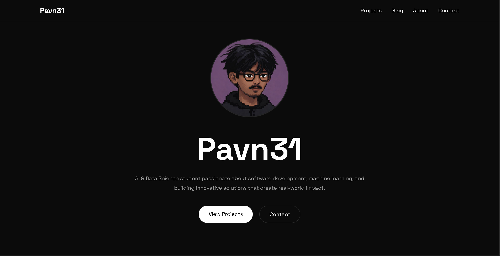

# 🚀 Pavan's Portfolio

Welcome to my personal portfolio website! This website showcases my projects, technical skills, certifications, achievements, and development journey.

## 🌐 Link
🔗 [Visit Portfolio](https://www.pavn31.dpdns.org/)

---

## 📌 About

I am a passionate developer interested in Software Development, IoT, Artificial Intelligence, and Data Science. This portfolio serves as a central place to showcase my work, skills, certifications, and learning journey.

---

## ✨ Features

- Responsive Design
- Modern UI/UX
- Smooth Animations
- Project Showcase
- Blog Section
- Skills & Technologies
- Contact Information
- Mobile Friendly

---

## 🛠️ Tech Stack

- HTML5
- CSS3
- JavaScript
- Git
- GitHub

---

## 📂 Project Structure

```text
portfolio/
│
├── assets/
│   ├── images/
│   ├── icons/
│   └── documents/
│
├── index.html
├── style.css
├── script.js
└── README.md
```

---

## 📸 Portfolio Preview

Add your screenshot below:

```md

```

---

## 🚀 Featured Projects

### Smart Blind Stick
An IoT-based assistive system designed to help visually impaired individuals navigate safely using ultrasonic sensors, GPS tracking, and emergency alerts.

### Personal Portfolio Website
A modern portfolio website showcasing projects, technical skills, certifications, blogs, and contact information.

### AI & Data Science Projects
A collection of beginner-to-intermediate machine learning and data science projects demonstrating practical applications of AI.

---

## 🏆 Certifications

- Cisco Networking Academy
- Python Programming
- AI & Data Science Courses
- Additional certifications available on the portfolio website

---

## 📫 Connect With Me

- GitHub: https://github.com/Pavn31
- LinkedIn: [https://linkedin.com/in/](https://www.linkedin.com/in/pavn-badiger/)
- Email: pavnbadiger@gmail.com
---

## 💻 Running Locally

Clone the repository:

```bash
git clone https://github.com/Pavn31/portfolio.git
```

Navigate to the project folder:

```bash
cd portfolio
```

Open `index.html` in your browser.

---

## 📈 Future Improvements

- Dark/Light Mode Toggle
- Project Filtering
- Blog Search
- Backend Integration
- Contact Form Functionality

---

## ⭐ Show Your Support

If you like this project, give it a ⭐ on GitHub!

---

<p align="center">
  Made with ❤️ by <strong>Pavan</strong>
</p>
