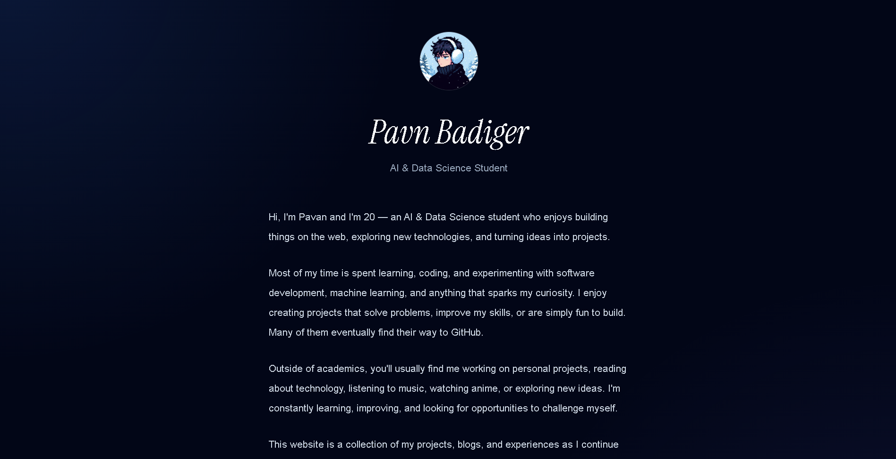
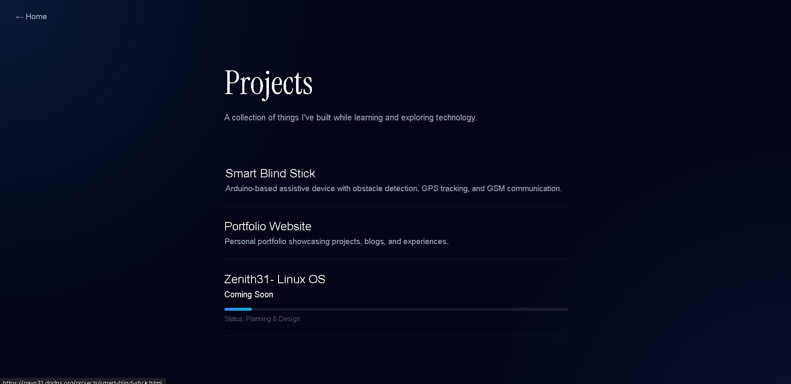

# ✨ Pavn31 Portfolio

> A modern, responsive portfolio website built to showcase my projects, blogs, and journey in AI & Data Science.


---

## 🚀 Features

* 📱 Fully Responsive Design
* 🎨 Modern & Minimal UI
* 💼 Project Showcase
* 📬 Social & Contact Links
* ⚡ Smooth Animations and Transitions

---

## 🛠 Tech Stack

| Technology   | Usage         |
| ------------ | ------------- |
| HTML5        | Structure     |
| CSS3         | Styling       |
| JavaScript   | Interactivity |
| Font Awesome | Icons         |
| Google Fonts | Typography    |

---

## 📂 Project Structure

## 📂 Project Structure

```text
PORTFOLIO-PVN31/
│
├── .vscode/
│
├── assets/
│   ├── Home-Page.png
│   ├── Icon.jpg
│   ├── PFP.jpg
│   └── Project-Section.png
│
├── projects/
│   ├── index.html
│   ├── Portfolio.html
│   ├── smart-blind-stick.html
│   └── Zenith31.html
│
├── index.html
├── README.md
├── robots.txt
├── script.js
├── sitemap.xml
└── style.css
```
---

## 🌟 Featured Project

### Smart Blind Stick

An Arduino-powered assistive device designed to help visually impaired individuals navigate more safely and independently.

#### Features

* 🚧 Obstacle Detection
* 📍 GPS Tracking
* 📞 GSM Emergency Alerts
* 🔊 Voice Guidance System

---

## 📸 Preview

### Home Page



### Project Page



---

## 🔗 Live Demo

🌐 **Portfolio Website**
https://pavn31.dpdns.org

---

## 📬 Contact

* GitHub: https://github.com/Pavn31
* LinkedIn: https://www.linkedin.com/in/pavn-badiger/
* Email: [pavanbadiger@gmail.com](mailto:pavanbadiger@gmail.com)

---

## ⭐ Support

If you found this project useful, consider giving it a ⭐ on GitHub.

---

<p align="center">
  Made with ❤️ by <strong>Pavan</strong>
</p>
